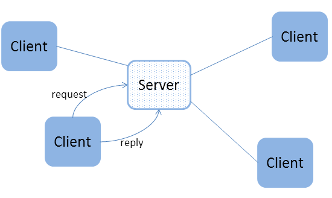
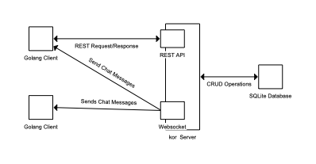

:source-highlighter: rouge
:highlightjs-languages: golang, kotlin

= Distributed Programming with Golang and Kotlin - A Comparsion

Written by Mehmet Aslan on January 8th, 2022

<<<
:toc:
<<<

== Abstract

This paper aims to give an overview on how to use distributive programming with an exemplary project using Golang and Kotlin. Both programming languages are introduced together with a definition for distributed programming and systems. To explain the example project, several ideas and concepts are included and related in/to the project are explained. The result is a chat system with a backend written Kotlin and clients developed in Golang.

<<<

== 1. Overview and Introduction of used Programming Languages

=== Kotlin

Kotlin is a modern multiparadigm programming language developed by JetBrains. It was unveiled in July 2011 as a new language for the Java Virtual Machine (JVM). With the first stable release in February 2016, Kotlin was adopted as the primary programming language for Google's Android platform. As Kotlin targets the JVM, it allows for interoperability with other JVM-based libraries and frameworks, which results in its support for projects targeting Java like the Spring ecosystem.

From its initial presentation to now, the scope of the language includes now both environments based on JavaScript as well as native ones using LLVM. As a language supporting multiparadigm, Kotlin supports object-oriented, Functional, and imperative approaches. Today, Kotlin enjoys a high adoption rate in the developer community, especially within the ranks of Android developers. 

=== Golang

Golang is compiled and statically typed programming language designed at Google with a focus on network services, cluster, and cloud computing environments. Popular projects include Kubernetes, a container management system, Teraform, a tool for provisioning resources in cloud environments, and more. 

During its development cycle, the designers behind the language took inspiration from the C programming language with an emphasis on simplicity and safety. This includes memory pointers without arithmetic and a lack of full support of an object-oriented paradigm based on inheritance. Due to its simplicity and high performance compared to other languages, Golang is highly regarded by the developer community today.

<<<

== 2. Definition of Distributed Programming and Systems

As the systems of today become more complex and more widespread, a common understanding of the term is required in order to further discuss related structures and concepts.
To run a program, computational resources are required. For this paper, modern computers are used, each its own one or more CPU cores.

The most simple program takes the form of a sequential program. As the name implies, the statements are executed by a single core in the order they are specified. Concurrent programs on the other hand are a set of sequential programs sharing a CPU core on a single machine, which introduces a scheduling schema for allocating resources. Parallel programming takes this idea further by using separate programs on each core of the machine. Due to the increasing complexity and user numbers over time, the idea behind parallel programming evolved to the concepts of distributed systems and programming. The boundaries of a program running on a single machine are broken down. Instead, the program or system is deployed onset of machines each capable of communicating with each other and outside the collection if necessary. The aspect of communication is realized by the usage of networks based on the OSI network architecture and applications/protocols running on top of it.

<<<

== 3. Structures and Concepts for Example Project

In order to develop, deploy and maintain distributed systems several ideas and concepts were developed over time. In the following section, relevant ones to the example project are presented and explained.

=== Software Architecture

==== Client-Server

Thie Client-Server architecture is one of the most fundamental ones to be found when encountering distributed systems. This concept includes the two eponymous actors: the server and the client. 

The client initiates a connection to the server with a request in mind while the server part provides the function or the service required to fulfill the client's request. After connection initiation, the client provides the server the request specifying the function or service to be invoked including parameters if necessary. Once the execution is finished by the server, the result of the operation is sent to the requesting client. This form of communication is commonly referred to as the Request-Response mechanism. Typically, this exchange is performed synchronously, meaning the connection between the two actors is actively maintained while the client awaits the result of the operation in a blocking manner. This modus operandi is utilized by short-running operations, where the result of the operation is immediately required.
It is also possible to implement the Request-Response model in an asynchronous way. After the request is received by the server, the current connection is terminated and the request is executed without the client actively waiting for the result of the operation. Once the result is available, the client is notified of the result and the result is provided to it. This pattern is used to perform long-running operations.

.Client-Server Model

<<<

==== n-Tier

In an n-tiered architecture, the system is split into different layers stacking on top of each other. Each layer has a specific responsibility and manages its own dependencies. The differentiation of layers can be both virtual and physical. Physical in terms that the layer being hosted on a different machine and virtual when the separation is logical. To communicate with each other, layers are required to provide interfaces to invoke the provided functionality hiding the actual implementation. While a layer is able to access lower layers, access to higher-tiered ones is denied. The accessibility of lower layers can be either open styled, which allows skipping immediate layers, or close styled, where the only access to the layer next down. The most common occurrence of this architecture takes the shape of 3-Tier architecture.

.3-Tiered Architecture
image::images/3-tier-arch.png[3-Tiered Architecture]

The 3-Tier architecture consists of the Presentation layer, Business Logic layer, and Data layer. The Presentation layer acts as the frontend, where end-users interact with the system using commonly a graphical user interface. The resulting commands and requests are then sent to the Business Logic layer. This one handles the required logic for the system including necessary decisions, evaluations, and calculations. The management of the necessary data to perform those requests and commands is the responsibility of the Data layer, which CRUD (Create, Read, Update, Delete) functionality as well as more complex data operations.

<<<

=== Communication

==== REST
The Representational State Transfer (REST) is a set of architectural constraints for designing APIs. It is based on the Client-Server principle, in which the client transfers a representation of the state to the server or endpoint. In order to consider an API as a RESTful, it is required to fulfill the following criteria:

* Requests and responses managed through HTTP
* Stateless communication between client and server
* Cacheable data for streamlining client-server interactions
* Uniform interface between components for information transference in a standard form
** Requested resources uniquely identifiable
** Manipulation of resources via state representation
** Self-descriptive responses to client
** Availability of hypermedia/hypermedia for finding available actions by clients

==== Websockets

Sockets in general allow for full-duplex communication between two or more separate processes. The socket is bound to a resource (either a port on the server or a file descriptor when used in the context of operating systems), in which connected parties are able to both write and receive messages from each other. The idea is now standardized for the Internet and is available in the form of Websockets. As they are intended to be used on the Internet, Websockets are designed to be compatible with HTTP. The WebSocket itself is bound to a port on the server and accessible via the `ws` or `wss` uniform resource identifier schemes by clients. After a successful handshake between the client and the server and the establishment of a connection, connected parties are able to exchange data in the form of messages via provided WebSocket by the server. Those messages are in most often character strings or arrays of bytes.
As WebSockets allow for two-way connection, they are especially suited for long-term communication as well as exchanging data without explicit request granting the ability of real-time communication. 

<<<

=== Concurrency

==== Coroutines
Coroutines are used for simultaneous execution of code. Compared to threads, which allow for parallel computing and run independently from each other, coroutines are designed to be concurrent and cooperative. In essence, coroutines consist of blocks of code that be suspended and resumed at a given time. In practice, while a coroutine is executed, the execution can be paused at the end of a suspendable code block with another coroutine taking its place instead. As coroutines follow the principle of concurrent programming, the ability to switch execution contexts is included. Compared to threads, which require the handling and throwing system interrupts by the operating system when changing context, coroutines instead rely on mechanisms provided by the execution environment. In terms of resource consumption, each time a new thread is created, memory space is allocated for its own stack. As coroutines do not possess their own stack, they are more lightweight and which allows creating a greater number of simultaneously running coroutines compared to threads.

<<<

Launching a coroutine in Golang:
[,golang]
----
go coroutine()
----
Launching a coroutine in Kotlin:
[source, kotlin]
suspend fun doSmth() {...} //Only invokable in a coroutine
launch {
 doSmth()
}

<<<

==== Channels
To pass data between them, coroutines both in Golang and Kotlin use channels to pass data between in the form of messages compared to shared memory space. They allow for awaiting data in a non-blocking manner. Once a value is received, the receiving coroutine resumes and starts processing the value. When finished, it is suspended and waits for the next value to arrive. Channels come in two types of flavors in both programming languages: one for sending data and one for receiving data. They have been often utilized to build pipelines following the Producer-Consumers pattern. One coroutine produces a stream of values which are passed via a channel. On the receiving end of the channel, another coroutine consumes or processes them.

<<<

Pipeline example in Kotlin:
[source, kotlin]
fun CoroutineScope.produceNumbers() = produce<Int> {
 var x = 1
 while (true) send(x++) // infinite stream of integers starting from 1
}
fun CoroutineScope.square(numbers: ReceiveChannel<Int>): ReceiveChannel<Int> = produce {
 for (x in numbers) send(x * x)
}
val numbers = produceNumbers() // produces integers from 1 and on
val squares = square(numbers) // squares integers
repeat(5) {
 println(squares.receive()) // print first five
}
println("Done!") // we are done
coroutineContext.cancelChildren() // cancel children coroutines

<<<

Pipeline example in Golang:
[source,golang]
func gen(nums ...int) <-chan int {
 out := make(chan int)
 go func() {
 for _, n := range nums {
 out <- n
 }
 close(out)
 }()
 return out
}
func sq(in <-chan int) <-chan int {
 out := make(chan int)
 go func() {
 for n := range in {
 out <- n * n
 }
 close(out)
 }()
 return out
}
func main() {
 // Set up the pipeline.
 c := gen(2, 3)
 out := sq(c)
 // Consume the output.
 fmt.Println(<-out) // 4
 fmt.Println(<-out) // 9
}

<<<

== 4. Example Project: A Chat System with Golang and Kotlin
To demonstrate distributed programming in both Kotlin and Golang, a chat system was built.
To make the example realistic, the following use cases were defined for the system:

* Creating new users with username and password for JWT authentication
* Creating and adding users to chat groups
* Sending messages to chat groups
* Automatically receiving of new messages

From an architectural perspective, a 3-Tiered approach is utilized. The Presentation layer consists of CLI clients written Golang due to a lack of experience with it while the Business Logic and Data layer are encapsulated in a server written in Kotlin as I am already familiar with the programming language.
The following libraries were used for the server:

* ktor: Coroutine based backend library written in Kotlin for providing RESTful APIs, Websocket, and authentication via ktor plug-ins
* koin: Kotlin IoC-Container for Dependency Injection
* Exposed: Kotlin SQL Framework

The following libraries were used for the client

* Gorilla: Web Toolkit for Golang with gorilla/WebSocket for Websockets
* http: Internal Golang library for HTTP requests

Here is an overview of the final system:

.Project Overview

<<<

== 5. Conclusion

In the end, both programming languages allow for distributed programming. Thanks to the adoption of the developer community, both Kotlin and Golang have access to a great number of libraries and frameworks and documentation for developing distributed systems without too much effort while the native support of coroutines in both makes it possible to maintain a high degree of scalability. As for the example project, with a bit more familiarity in Golang, it would be possible to reverse the client and server roles.

== References

*Sources*

Krill, Paul(2011): JetBrains readies JVM-based language, in: InfoWorld, [online] https://www.infoworld.com/article/2622405/jetbrains-readies-jvm-based-language.html [11.01.2022]

Get Started with Kotlin, [online] https://kotlinlang.org/docs/getting-started.html [11.01.2022]

Kirsch, Christian(2009): Go: Googles Programmiersprache für Abenteuerlustige, in: heise online, [online] https://www.heise.de/ix/meldung/Go-Googles-Programmiersprache-fuer-Abenteuerlustige-855912.html [11.01.2022]

Categories of computer programs: [online] https://docs.microsoft.com/en-us/learn/modules/cmu-distributed-programming-introduction/1-taxonomy-programs [11.01.2022]

What is Client Server Architecture?: [online] https://intellipaat.com/blog/what-is-client-server-architecture/ [11.01.2022]

Price, Ed; Buck, Alex; Lee, Dennis; Peterson, Neil; Kshirsagar, Dhanashri (2021): N-tier architecture style, in: Application Architecture Guide, [online] https://docs.microsoft.com/en-us/azure/architecture/guide/architecture-styles/n-tier [11.01.2022]

What is a REST API?, [online] https://www.redhat.com/en/topics/api/what-is-a-rest-api [11.01.2022]

Pedamkar, Priya: What is WebSocket?, in: Software Development Basics, [online] https://www.educba.com/what-is-websocket/ [11.01.2022]

Coroutines basics, [online] https://kotlinlang.org/docs/coroutines-basics.html [11.01.2022]

Coroutines, in: Concurrency, [online] http://www.golangpatterns.info/concurrency/coroutines [11.01.2022]

Channels, [online] https://kotlinlang.org/docs/channels.html [online]

Channels in GoLang, [online] https://golangdocs.com/channels-in-golang [online]

Ajmani, Sameer(2014): Go Concurrency Patterns: Pipelines and cancellation, [online] https://go.dev/blog/pipelines [11.01.2022]

codinglance(2021): KOTLIN COROUTINE V/S THREAD, [online] https://codinglance.com/kotlin-coroutine-v-s-thread/ [online]

*Images*

Figure 1: https://community.rti.com/static/documentation/connext-dds/5.2.0/doc/manuals/connext_dds/html_files/RTI_ConnextDDS_CoreLibraries_GettingStarted/Content/Resources/Images/Intro_client_server.png

Figure 2: https://docs.aws.amazon.com/whitepapers/latest/serverless-multi-tier-architectures-api-gateway-lambda/images/image2.png
